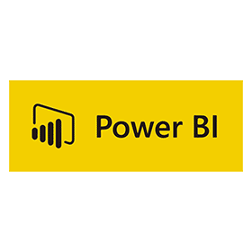
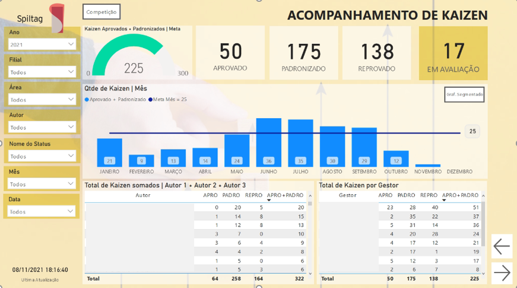
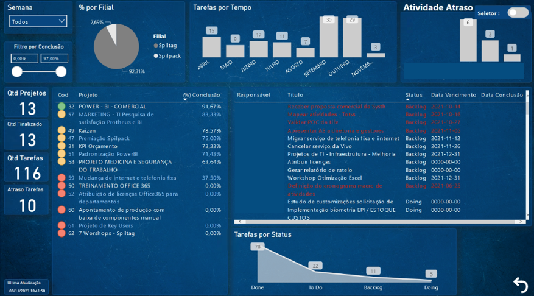
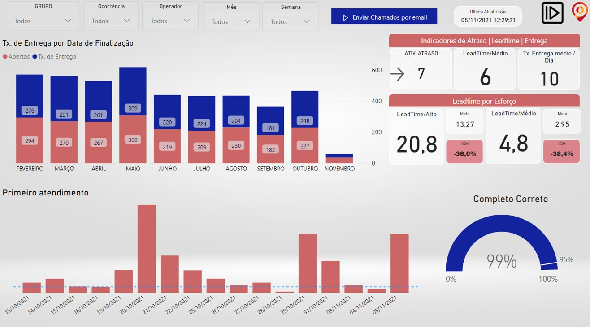
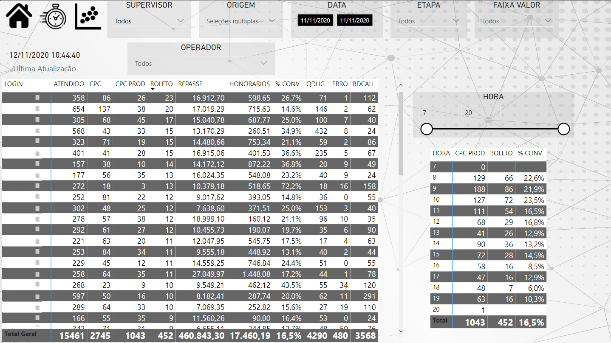
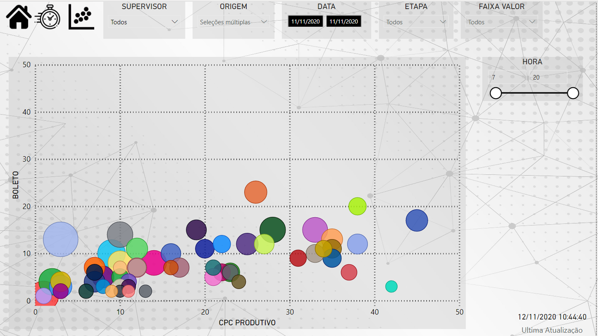

### Bem-vindo! Tudo bem? Espero que sim. 

Meu objetivo nesta pagina é demonstrar o meu trabalho, aquilo que faço e quais ferramentas utilizo em meu dia a dia. 

# Quem é Ronaldo?

Bom, meu nome você já sabe, tenho 33 anos, sou casado há 8 anos com uma esposa maravilhosa e temos 2 lindos filhos. 
Estou me formando em 2 faculdades, sendo elas, teologia(conclusão em 2023) e processos gerenciais(conclusão em 2021), além de cursos que tenho feito para aprimorar o conhecimento, estatística para data science, python analytics, Powerbi, Rshiny(criação de dashboards), entre outros.

# Ferramentas.

 
 
 
 
 

### Atualmente

Atuo em uma indústria com ritmo de **crescimento**, **dinâmica** com espírito **jovem** focada na transformação digital, para isso utilizamos as poderosas ferramentas **Lean**, que nos auxiliam para um crescimento perene. 
Meu trabalho começa na elaboração de dashboards conectados diretamente ao nosso banco de dados, gerando conhecimento para tomada de decisão, visando o bem comum. 
Também estou envolvido em um projeto de mineração de dados, que possui como foco alinhar as informações internas com externas, tendo aumento de marketshare. Logo mais coloco informações dele aqui. 

### Segue alguns dashboard desenvolvidos
<dl>
 

  
 
 
 
 
 

</dl>

## Redes Sociais

<a href="https://github.com/ronaldobribeiro/">GitHub</a>

<a href="https://www.instagram.com/ronaldogribeiro/">Instagram</a>

<a href="https://www.linkedin.com/in/ronaldo-garcia-ribeiro/">Linkedin</a>

